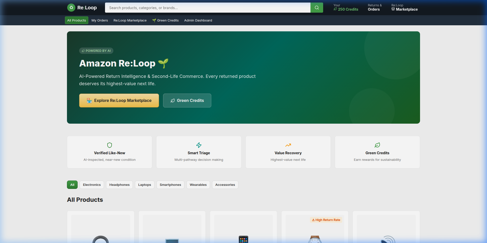
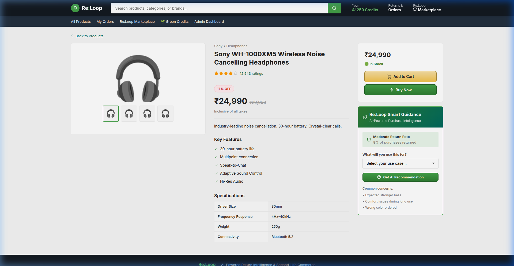
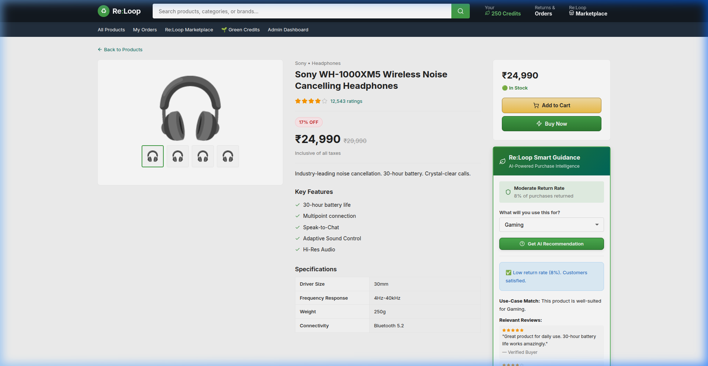
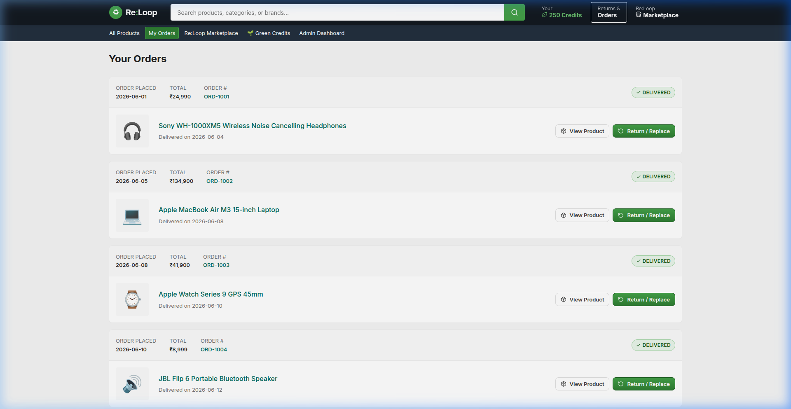
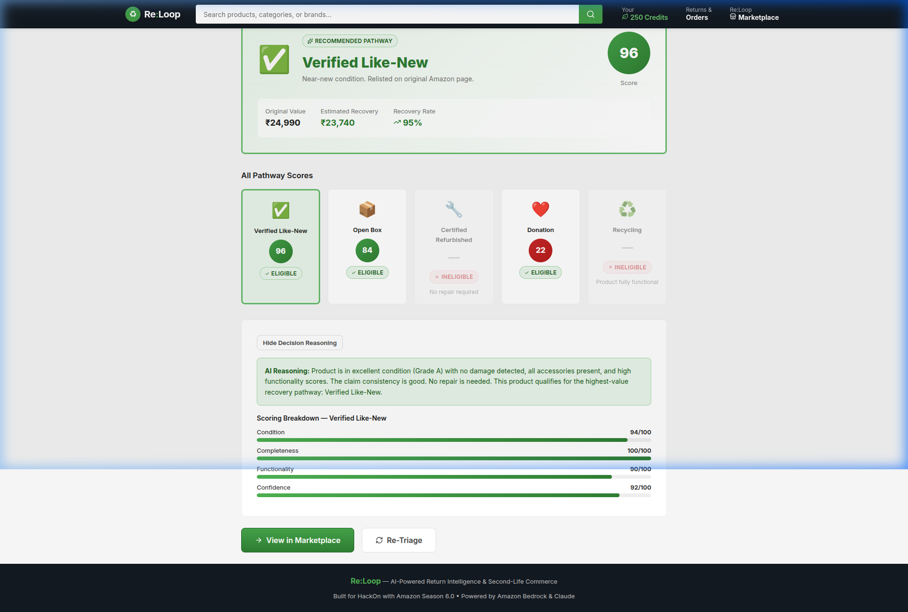
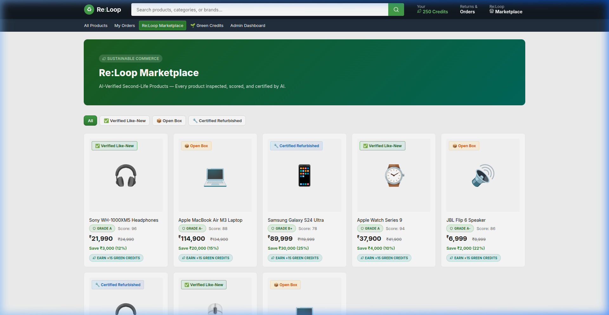
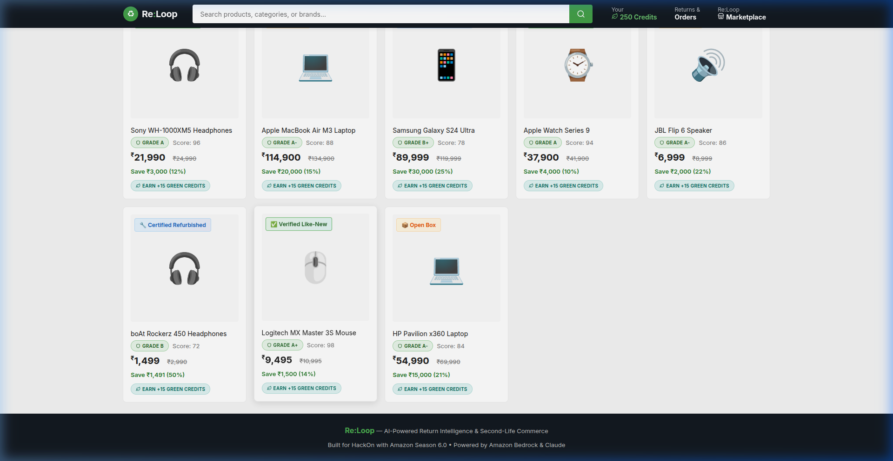
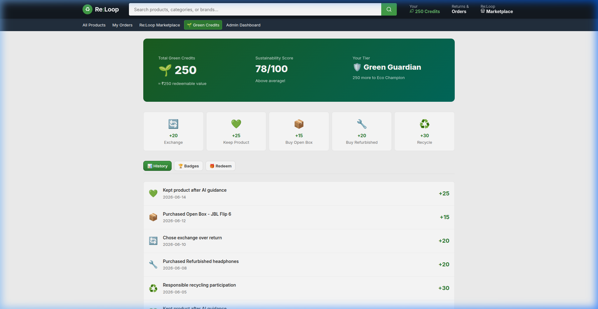

# Amazon Re:Loop 🌱

## AI‑Powered Return Intelligence & Second‑Life Commerce

### Turning Returns into the Highest‑Value Next Life for Every Product

> **Built for HackOn – Amazon Season 6.0**  
> **Powered by Google Gemini (Gemini 2.5‑Flash)**

---

## 📑 Table of Contents

1. [Executive Summary](#executive-summary)
2. [The Problem](#the-problem)
3. [Our Solution — The Re:Loop Pipeline](#our-solution--the-reloop-pipeline)
4. [Complete Pipeline Flow](#complete-pipeline-flow)
5. [Module Deep‑Dive](#module-deep-dive)
   - [Module 1 — Smart Pre‑Purchase Guidance](#module-1--smart-pre-purchase-guidance)
   - [Module 2 — Emotion‑Aware Return Interception](#module-2--emotion-aware-return-interception)
   - [Module 3 — AI Inspection & Verification Engine](#module-3--ai-inspection--verification-engine)
   - [Module 4 — AI Triage Engine](#module-4--ai-triage-engine)
   - [Module 5 — Intelligent Product Labelling & Marketplace](#module-5--intelligent-product-labelling--marketplace)
   - [Module 6 — Green Credits & Sustainability](#module-6--green-credits--sustainability)
   - [Module 7 — Admin Operations Dashboard](#module-7--admin-operations-dashboard)
6. [Expert Technician Routing](#expert-technician-routing)
7. [Platform Benefits & Cost Savings](#platform-benefits--cost-savings)
8. [Tech Stack & Architecture](#tech-stack--architecture)
9. [Setup & Installation](#setup--installation)
10. [API Reference](#api-reference)
11. [Implementation Screenshots](#implementation-screenshots)
12. [License](#license)

---

## 🚀 Live Demo

**Frontend (Vercel):** [https://re-loop-seven.vercel.app](https://re-loop-seven.vercel.app)

**Backend API (AWS EC2):** `http://16.170.40.115:3001`

> [!WARNING]
> **Important Note for Judges**: Because the backend is hosted on a free AWS EC2 instance without an SSL certificate (`http`), modern browsers may block the data from loading due to "Mixed Content" policies. 
> 
> **To view the live data:** Click the **Lock (or Settings) icon** next to the URL in your browser, go to **Site Settings**, and change **Insecure content** to **Allow**. Refresh the page, and the AI pipeline will fully populate!

---
## Executive Summary

Amazon returns are not just a logistics problem — they are a **value‑recovery problem**.

A significant percentage of returned products are still near‑new, fully functional, or only lightly used. Yet without an intelligent system to inspect, verify, and route them, many of these products lose value unnecessarily through conservative downgrading, delayed processing, or suboptimal disposition decisions.

**Re:Loop** solves this by transforming the entire return lifecycle — from the moment *before* a customer places an order, through the emotional moment when they initiate a return, all the way to the final disposition — into an **AI‑powered decision‑making pipeline** that determines the **highest‑value next life** for every product.

**Key outcomes:**
- 🛡️ **Fewer unnecessary returns** — AI guidance helps customers buy the right product the first time
- 🧠 **Smarter interceptions** — Emotion‑aware classification turns some returns into exchanges or keeps
- 🔍 **Accurate inspections** — Multi‑modal AI generates a product condition profile without a warehouse visit
- 🎯 **Optimal routing** — Multi‑pathway triage sends each item to its highest‑value destination
- 💰 **Maximum recovery** — Products that are near‑new get relisted at 88–95% of original value
- 🌱 **Sustainability rewards** — Customers earn Green Credits for every eco‑friendly action

---

## The Problem

### Why Returns Are Expensive

Every return costs the platform money across multiple stages:

| Cost Stage | Description |
|------------|-------------|
| Reverse logistics | Pickup, shipping, handling |
| Manual inspection | Warehouse staff evaluating each item |
| Incorrect classification | A near‑new headphone marked as "refurbished" loses ₹3,000 in potential resale value |
| Delayed relisting | Inventory depreciates 1–2% per week while sitting in processing |
| Customer distrust | Buyers hesitate to purchase second‑life products without transparent condition data |

### The Core Insight

> **The real problem is not processing returns. The real problem is making the correct decision for each returned product — and ideally preventing the unnecessary ones from happening at all.**

Traditional return systems treat every return the same way. Re:Loop treats each product as an individual intelligence problem.

---

## Our Solution — The Re:Loop Pipeline

Re:Loop covers the **complete product lifecycle**, not just the post‑return phase:

```
┌─────────────────────────────────────────────────────────────────────────────┐
│                        AMAZON Re:Loop PIPELINE                             │
├─────────────────────────────────────────────────────────────────────────────┤
│                                                                             │
│  ❶ BEFORE ORDER             ❷ RETURN INITIATED         ❸ POST‑RETURN       │
│  ┌──────────────┐           ┌──────────────┐           ┌──────────────┐    │
│  │ Smart        │  ──────>  │ Emotion‑Aware│  ──────>  │ AI Inspection│    │
│  │ Pre‑Purchase │           │ Interception │           │ & Verification│   │
│  │ Guidance     │           │              │           │              │    │
│  └──────────────┘           └──────────────┘           └──────────────┘    │
│     │                          │                          │                │
│     │ Prevents                 │ Intercepts               │ Generates     │
│     │ unnecessary              │ avoidable                │ condition     │
│     │ returns                  │ returns                  │ profile       │
│     ▼                          ▼                          ▼                │
│  ₹0 cost avoided           ₹0 logistics cost          Accurate data      │
│                                                           │                │
│                                                           ▼                │
│  ❻ GREEN CREDITS            ❺ MARKETPLACE               ❹ AI TRIAGE      │
│  ┌──────────────┐           ┌──────────────┐           ┌──────────────┐    │
│  │ Sustainability│ <──────  │ Intelligent  │  <──────  │ Multi‑Pathway│    │
│  │ Rewards      │           │ Product      │           │ Decision     │    │
│  │              │           │ Labelling    │           │ Engine       │    │
│  └──────────────┘           └──────────────┘           └──────────────┘    │
│     │                          │                          │                │
│     │ Incentivizes             │ Transparent              │ Selects       │
│     │ eco‑friendly             │ condition                │ highest‑value │
│     │ behaviour                │ disclosure               │ pathway       │
│     ▼                          ▼                          ▼                │
│  Customer loyalty           Buyer trust              Max recovery         │
│                                                                             │
│  ❼ ADMIN DASHBOARD — Real‑time KPIs, pathway analytics, expert alerts     │
│                                                                             │
└─────────────────────────────────────────────────────────────────────────────┘
```

---

## Complete Pipeline Flow

Here is how a product moves through the system end‑to‑end:

### Phase 1 — Before the Order Is Placed

A customer is browsing a product page. **Before they even click "Buy"**, Re:Loop's **Smart Guidance AI** (powered by Gemini) analyzes:

- The product's historical return rate
- The customer's stated use case
- Common reasons why other customers returned this product
- Size / variant compatibility

**Result:** The customer receives a personalized **return‑risk assessment** and **buying recommendation**. If the product is high‑risk for their use case, the AI suggests alternatives or warns about common pitfalls.

> 💡 *Example:* A customer wants Sony headphones for gym workouts. The AI flags: "These are premium noise‑cancelling headphones optimized for travel. For gym use, consider sweat‑resistant earbuds. Return risk: elevated."

### Phase 2 — When a Return Is Initiated

Despite guidance, the customer decides to return. Now Re:Loop's **Emotion‑Aware Return Interception** kicks in:

1. Customer selects a return reason and provides a free‑text explanation
2. The system **classifies the intent** into categories:
   - 🔧 **Genuine Defect** → Continue to inspection
   - 🔄 **Wrong Variant** → Suggest exchange (cheaper than a full return)
   - 🤔 **Preference Mismatch** → Offer guidance / alternative
   - 💭 **Impulse Regret** → Suggest keeping + earn Green Credits
   - 💰 **External Circumstance** → Check for price‑match or exchange
3. Based on classification, Re:Loop either **intercepts** the return (saving full logistics cost) or proceeds with intelligent inspection

> 💡 *Example:* "Changed my mind" → System suggests: "Many customers find more value after a short setup period. Keeping it earns you 25 Green Credits and avoids waste." → Customer keeps the product → ₹0 return cost.

### Phase 3 — Intelligent Inspection (If Return Proceeds)

The product enters the **AI Inspection & Verification Engine**:

1. **Smart Capture Assistant** — Guides the customer to upload photos from specific angles (category‑aware: headphones need earcup close‑ups, laptops need port views)
2. **Vision Inspection** — AI scores visual condition, detects scratches/damage, evaluates packaging
3. **Adaptive Follow‑Up Questions** — Category‑specific questions that images alone can't answer (e.g., "Do both speakers work?", "Does the laptop boot normally?")
4. **Claim Verification** — Cross‑references the customer's stated reason against the observed evidence

**Output:** A complete **Product Condition Profile** with six scores:

| Score | Description |
|-------|-------------|
| Condition Score | Weighted composite (0–100) |
| Visual Score | Cosmetic / surface assessment |
| Functionality Score | Hardware / performance check |
| Accessory Score | Completeness of accessories |
| Claim Consistency | Customer claim vs observed evidence |
| Confidence Score | How reliable the overall assessment is |
| Grade | A, A‑, B+, B, or C |

### Phase 4 — AI Triage (Disposition Decision)

The condition profile feeds into the **AI Triage Engine**, which evaluates **six recovery pathways independently**:

| Pathway | Min Score | Recovery Rate | Description |
|---------|-----------|---------------|-------------|
| ⭐ Restock Original | 95 | 100% | Pristine + high‑value → back to Amazon primary inventory |
| ✅ Verified Like‑New | 88 | 95% | Near‑new condition → relisted on Re:Loop Marketplace |
| 📦 Open Box | 70 | 82% | Fully functional, packaging opened |
| 🔧 Certified Refurbished | 58 | 70% | Repaired and tested |
| ❤️ Donation | 35 | 25% | Social value exceeds resale value |
| ♻️ Recycling | 0 | 5% | Responsible end‑of‑life handling |

**Gemini AI** evaluates each pathway, assigns scores, and selects the **highest‑priority eligible pathway**. If confidence is low, the product is high‑value, or critical defects are detected, the system flags it for **Expert Technician Review** (see below).

### Phase 5 — Marketplace Listing

Products triaged to Verified Like‑New, Open Box, or Certified Refurbished are **automatically listed** on the Re:Loop Marketplace with:
- Transparent condition scores
- AI‑generated inspection report
- Adjusted pricing (88% for Like‑New, 82% for Open Box, 70% for Refurbished)
- Verification badge with inspection date

### Phase 6 — Green Credits

Throughout the pipeline, customers earn Green Credits for sustainable actions:

| Action | Credits |
|--------|---------|
| Keep product after AI guidance | 25 |
| Exchange instead of return | 20 |
| Buy an Open Box product | 15 |
| Buy a Refurbished product | 20 |
| Recycle responsibly | 30 |
| Sustainable routing (donation/recycling) | 20 |

Credits unlock rewards: ₹100 off, free shipping, early access to deals, and more. Tiers progress from **New → Eco Explorer → Green Guardian → Eco Champion**.

---

## Module Deep‑Dive

### Module 1 — Smart Pre‑Purchase Guidance

**Goal:** Prevent returns before they happen.

**How it works:**
- Customer enters their use case on any product page
- Gemini 2.5‑Flash analyzes the product specs, return rate, common complaints, and customer intent
- Returns a personalized risk assessment with:
  - Use‑case match analysis
  - Size / variant recommendation
  - Return risk level (low / moderate / elevated)
  - Relevant customer reviews
  - Final buying recommendation

**Why this matters:** Every prevented return saves ₹200–₹500 in reverse logistics alone, plus the inventory depreciation that occurs during processing.

---

### Module 2 — Emotion‑Aware Return Interception

**Goal:** Understand *why* the customer is returning and intercept avoidable returns.

**How it works:**
- Customer selects from 8 return reasons and provides free‑text explanation
- The system classifies the return into one of 5 emotional categories
- Based on classification:
  - **Genuine Defect / Missing Parts** → Proceed to inspection (necessary return)
  - **Wrong Variant** → Suggest exchange (saves full return cost, customer gets the right product)
  - **Preference Mismatch** → Offer guidance or alternative products
  - **Impulse Regret** → Nudge to keep with Green Credits incentive
  - **External Circumstance** → Explore price‑match or exchange options

**Why this matters:** Even intercepting 10% of returns translates to massive savings in logistics, processing, and inventory depreciation.

---

### Module 3 — AI Inspection & Verification Engine

**Goal:** Build an accurate digital condition profile without a warehouse visit.

**4 phases:**
1. **Smart Capture** — Category‑specific photo angles (e.g., headphones: 5 angles; laptops: 6 angles)
2. **Vision Inspection** — AI‑scored visual, functionality, and packaging condition
3. **Adaptive Questions** — Category‑aware follow‑up questions for information that photos can't reveal
4. **Claim Verification** — Cross‑reference customer's stated reason vs. observed evidence

**Output:** A grade (A through C) and a multi‑dimensional condition profile.

**Why this matters:** Better inspection data leads to better routing decisions. Products that are truly near‑new get relisted at 95% value instead of being unnecessarily downgraded.

---

### Module 4 — AI Triage Engine

**Goal:** Determine the highest‑value next life for every returned product.

**How it works:**
- Gemini AI receives the condition profile, product details, and all 6 pathway definitions
- Each pathway is scored independently (not a single overall score)
- The highest‑priority eligible pathway is selected
- **Re‑Triage capability** — If new information arrives (physical inspection, repair outcomes), the engine re‑evaluates dynamically

**Expert Technician Flag:** Automatically set when:
- Product price exceeds ₹50,000
- AI confidence falls below 80%
- Functionality score is below 80 or visual score is below 70

**Fallback logic:** If the Gemini API is unavailable, the system uses a deterministic scoring algorithm to ensure triage never fails.

---

### Module 5 — Intelligent Product Labelling & Marketplace

**Goal:** Build buyer trust through transparent condition disclosure.

Products on the Re:Loop Marketplace include:
- **Condition grade** (A, A‑, B+, B, C)
- **Individual scores** for visual, functionality, accessories, and confidence
- **AI inspection report** with details on cosmetic condition, functionality, packaging, and accessories
- **Inspection type** (AI + customer evidence verification)
- **Inspection date**
- **Transparent pricing** based on condition grade

---

### Module 6 — Green Credits & Sustainability

**Goal:** Incentivize sustainable customer behaviour.

- **Wallet system** with credits, tiers, badges, and transaction history
- **Tier progression:** New → Eco Explorer (100 credits) → Green Guardian (250) → Eco Champion (500)
- **Redeemable rewards:** Discounts, free shipping, early access
- **Badge system:** Achievement badges for sustainable milestones

---

### Module 7 — Admin Operations Dashboard

**Goal:** Give operations managers real‑time visibility into the return pipeline.

**KPI Cards:**
- Total returns processed
- Value recovered (₹)
- Returns prevented (count + value saved)
- Green Credits issued across all users

**Analytics:**
- Recovery Pathway Distribution (% breakdown across all 5 pathways)
- Return Classification Breakdown (% of each emotion category)

**Returns Table:**
- Every return with status, pathway, score, and date
- **Expert Required badge** — red alert badge for items flagged for human review
- Click‑through to triage details or marketplace listing

---

## Expert Technician Routing

When the AI triage engine determines that a returned product requires human oversight, it sets `requiresExpert: true`. This happens when:

| Trigger | Threshold | Rationale |
|---------|-----------|-----------|
| High product value | Price > ₹50,000 | Expensive items require careful disposition to avoid significant losses |
| Low AI confidence | Confidence < 80% | The AI is unsure — a human expert should verify |
| Functionality concern | Functionality < 80 | Potential hardware defect needs hands‑on testing |
| Visual concern | Visual score < 70 | Significant cosmetic damage needs physical assessment |

**Admin visibility:**
- 🛡️ Red **"Expert Reqd"** badge appears next to the return status in the Admin Dashboard table
- A prominent error alert banner appears on the individual Triage page

This ensures that high‑risk items are never auto‑routed without human confirmation.

---

## Platform Benefits & Cost Savings

### For Amazon (the Platform)

| Benefit | How Re:Loop Delivers It |
|---------|------------------------|
| **Reduced return volume** | Pre‑purchase guidance prevents 10–15% of unnecessary returns |
| **Lower logistics cost** | Emotion‑aware interception converts some returns into exchanges/keeps (₹0 reverse logistics) |
| **Higher recovery rates** | Multi‑pathway triage recovers 82–100% of value instead of blanket downgrading |
| **Faster processing** | AI inspection eliminates manual warehouse review for straightforward cases |
| **Increased second‑life sales** | Transparent labelling builds buyer trust → higher marketplace conversion |
| **Sustainability credentials** | Green Credits program drives brand loyalty and ESG metrics |

### For Customers

| Benefit | How Re:Loop Delivers It |
|---------|------------------------|
| **Better purchase decisions** | AI guidance before buying reduces "wrong product" frustration |
| **Fairer return handling** | Emotion‑aware classification acknowledges the *reason*, not just the *action* |
| **Rewards for sustainability** | Green Credits turn eco‑friendly choices into tangible savings |
| **Trust in second‑life products** | Transparent condition reports make Re:Loop products feel reliable |

### Illustrative Cost Impact

```
Traditional Return Cost (per item):
  Reverse logistics      ₹150–₹500
  Warehouse inspection   ₹100–₹300
  Value loss (downgrade) ₹500–₹5,000
  ────────────────────────────────────
  Total                  ₹750–₹5,800

Re:Loop Approach:
  Pre-purchase prevention     ₹0  (return never happens)
  Emotion interception        ₹0  (customer keeps/exchanges)
  AI inspection (no warehouse) ₹0  (no manual labor)
  Optimal routing             88–100% value retained
  ────────────────────────────────────
  Net savings per return      ₹500–₹5,000+
```

At scale (millions of returns per year), even a 10% improvement in routing accuracy translates to **hundreds of crores** in recovered value.

---

## Tech Stack & Architecture

| Layer | Technology |
|-------|------------|
| **Frontend** | React 19 + Vite 8, Custom CSS design system, Lucide React icons |
| **Backend** | Node.js + Express 5 |
| **AI Engine** | Google Gemini 2.5‑Flash (via REST API with JSON mode) |
| **Database** | Amazon DynamoDB (local for development) |
| **Authentication** | JWT‑based mock auth (customer + admin roles) |
| **File Uploads** | Multer (inspection images) |

### Architecture

```
┌──────────────────┐       ┌──────────────────┐       ┌──────────────────┐
│   React Frontend │──────▶│  Express Backend  │──────▶│  Google Gemini   │
│   (Vite @ :5173) │◀──────│  (Node @ :3001)   │◀──────│  2.5‑Flash API   │
└──────────────────┘       └──────────────────┘       └──────────────────┘
                                   │
                                   ▼
                           ┌──────────────────┐
                           │  DynamoDB (Local) │
                           │  Tables:          │
                           │  • Products       │
                           │  • Orders         │
                           │  • Returns        │
                           │  • Marketplace    │
                           │  • Users          │
                           │  • Config         │
                           └──────────────────┘
```

### Key Backend Services

| Service | File | Responsibility |
|---------|------|---------------|
| **Gemini Service** | `geminiService.js` | Sends prompts to Gemini 2.5‑Flash, enforces JSON response format |
| **Re:Loop Service** | `reloopService.js` | Central orchestrator — guidance, classification, inspection, triage, credits |
| **Repository** | `repository.js` | DynamoDB CRUD abstraction layer |

### User Data Isolation

Every API request carries an `x-user-id` header. All data queries (orders, returns, credits) are filtered by user ID. New users are automatically initialized with:
- 3 mock orders (for demo purposes)
- An empty wallet (0 credits, "New" tier)
- Empty return history

---

## Setup & Installation

### Prerequisites
- Node.js 18+
- Docker (for local DynamoDB)
- A Google Gemini API key

### 1. Clone & Install

```bash
git clone https://github.com/your-org/reloop.git
cd reloop

# Backend
cd server
npm install

# Frontend
cd ../frontend
npm install
```

### 2. Configure Environment

```bash
# server/.env
GEMINI_API_KEY=your-gemini-api-key
DYNAMODB_ENDPOINT=http://localhost:8000
AWS_REGION=ap-south-1
AWS_ACCESS_KEY_ID=local
AWS_SECRET_ACCESS_KEY=local
```

### 3. Start DynamoDB Local

```bash
docker run -p 8000:8000 amazon/dynamodb-local
```

### 4. Seed the Database

```bash
cd server
npm run seed:local
```

### 5. Run the Application

```bash
# Terminal 1 — Backend
cd server
npm run dev          # http://localhost:3001

# Terminal 2 — Frontend
cd frontend
npm run dev          # http://localhost:5173
```

### Demo Accounts

| Role | Email | Password |
|------|-------|----------|
| Customer | `customer@reloop.com` | `customer` |
| Admin | `admin@reloop.com` | `admin` |

---

## API Reference

### Products & Guidance

| Method | Endpoint | Description |
|--------|----------|-------------|
| `GET` | `/api/products` | List all products (optional `?category=` filter) |
| `GET` | `/api/products/categories` | Get category list |
| `GET` | `/api/products/:id` | Get single product details |
| `POST` | `/api/products/:id/guidance` | **Gemini AI** — Smart pre‑purchase guidance |

### Returns

| Method | Endpoint | Description |
|--------|----------|-------------|
| `GET` | `/api/returns` | List returns for current user |
| `GET` | `/api/returns/reasons` | Get return reason options |
| `POST` | `/api/returns/initiate` | Create a new return request |
| `POST` | `/api/returns/:id/classify` | Classify return reason (emotion‑aware) |
| `POST` | `/api/returns/:id/decide` | Customer decision (keep / exchange / return) |
| `GET` | `/api/returns/:id/inspection` | Get inspection photo requirements |
| `POST` | `/api/returns/:id/upload` | Upload inspection images |
| `POST` | `/api/returns/:id/validate` | Validate uploaded image quality |
| `POST` | `/api/returns/:id/vision` | Run AI vision inspection |
| `GET` | `/api/returns/:id/questions` | Get adaptive follow‑up questions |
| `POST` | `/api/returns/:id/answers` | Submit follow‑up answers |
| `POST` | `/api/returns/:id/verify` | Verify customer claim vs evidence |
| `GET` | `/api/returns/:id/profile` | Get product condition profile |
| `POST` | `/api/returns/:id/triage` | **Gemini AI** — Run multi‑pathway triage |
| `POST` | `/api/returns/:id/retriage` | Re‑triage with updated data |
| `GET` | `/api/returns/:id/triage-result` | Get cached triage result |

### Marketplace

| Method | Endpoint | Description |
|--------|----------|-------------|
| `GET` | `/api/marketplace/listings` | Browse all marketplace listings |
| `GET` | `/api/marketplace/filters` | Get available filters |
| `GET` | `/api/marketplace/:id` | Get individual listing details |

### Green Credits

| Method | Endpoint | Description |
|--------|----------|-------------|
| `GET` | `/api/credits/wallet` | Get wallet balance, tier, badges, history |
| `POST` | `/api/credits/redeem` | Redeem credits for a reward |

### Admin

| Method | Endpoint | Description |
|--------|----------|-------------|
| `GET` | `/api/admin/dashboard` | Aggregated KPIs and analytics |
| `GET` | `/api/admin/returns` | All returns across all users |
| `GET` | `/api/triage/pathways` | Get all triage pathway definitions |

---

## Implementation Screenshots

### Homepage


### Product Detail — Smart AI Guidance


### AI Recommendation Loaded


### My Orders


### AI Triage — Multi‑Pathway Decision


### Re:Loop Marketplace


### Marketplace — Relisted Product


### Green Credits Wallet


---

## Hackathon Checklist

- [x] End‑to‑end pipeline: Pre‑purchase → Interception → Inspection → Triage → Marketplace → Credits
- [x] Gemini 2.5‑Flash integrated for AI Guidance and AI Triage
- [x] Expert Technician routing with admin‑visible badges
- [x] User data isolation (per‑user orders, returns, wallet)
- [x] Auto‑seeding for new demo users
- [x] Premium UI with custom design system, micro‑animations, and glassmorphism
- [x] Admin dashboard with KPIs, pathway analytics, and expert alerts
- [x] 19/19 E2E system audit tests passing
- [x] All orphaned files (Bedrock, test scripts) cleaned up
- [x] README updated with complete pipeline documentation

---

## License

This project was built for **HackOn – Amazon Season 6.0** and is provided for demonstration purposes.

---

<div align="center">

### 🌱 Re:Loop

**Turning Every Return Into Its Highest‑Value Next Life.**

*Because every returned product contains value. Every return contains information. Every recovery decision creates an opportunity.*

**Re:Loop ensures that opportunity is never wasted.**

</div>
